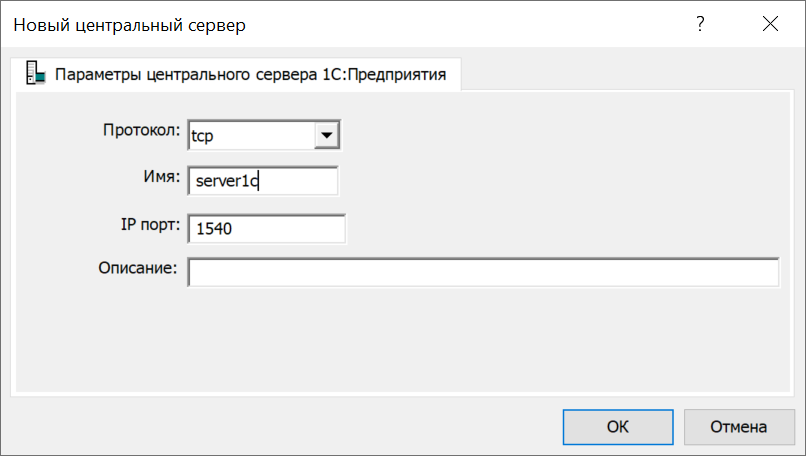
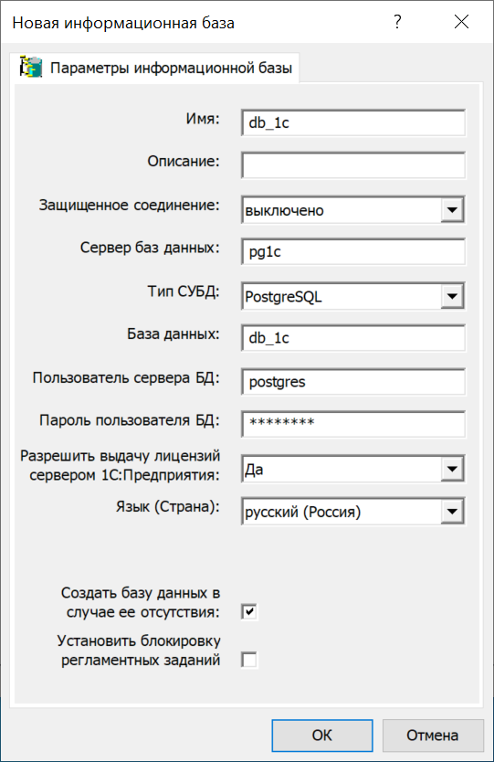

# Сервер для


---
## Развернуть сервер
Склонировать код себе на компьютер `git clone git@github.com:skoval67/1c_srvrs.git`. В файле `containers/srv1c.Dockerfile` задать значения переменным
```
ENV SERVER1C_VERSION 8.3.23
ENV REVISION 1782
```
создать каталог `containers/${SERVER1C_VERSION}` и положить туда файлы дистрибутивов
```
1c-enterprise-${SERVER1C_VERSION}.${REVISION}-common_${SERVER1C_VERSION}-${REVISION}_amd64.deb \
1c-enterprise-${SERVER1C_VERSION}.${REVISION}-server_${SERVER1C_VERSION}-${REVISION}_amd64.deb
```

Задать PreSharedKey
```
l2tp_ipsec_PSK: vpn
```
и логины/пароли пользователей для установки VPN соединения
```
l2tp_ipsec_server_users:
  - { username: user1, password: password1 }
  - { username: user2, password: password2 }
```
в файле `ansible/vars.yaml` и запустить `./start.sh`. Скрипт развернет виртуальный сервер в облаке, настроит весь необходимый софт на нем и выведет на экран его IP адрес *_1c_server_external_ip_address*. Его надо подставить вместо *ServerIPAddressOrHostname* в команде `Add-VpnConnection` при настройке vpn-соединения на клиенте. Terraform в этом скрипте заточен на работу с Yandex Cloud, поэтому надо соответствено [настроить окружение под него](https://cloud.yandex.ru/docs/tutorials/infrastructure-management/terraform-quickstart).

## Настроить компьютер клиента
На компьютере клиента добавить строки в файл `\Windows\System32\drivers\etc\hosts`<br>
```shell
172.20.0.3      server1c
172.20.0.5      pg1c
```
Включить поддержку NAT-T в Windows
```
Set-ItemProperty -Path "HKLM:SYSTEM\CurrentControlSet\Services\PolicyAgent" -Name "AssumeUDPEncapsulationContextOnSendRule" -Type DWORD -Value 2 –Force
```
Создать VPN-подключение L2TP/IPsec с общим ключом
```
Add-VpnConnection -Name "MyVpnName" -ServerAddress ServerIPAddressOrHostname -TunnelType L2tp -EncryptionLevel required -AuthenticationMethod MsChapv2 -SplitTunneling -RememberCredential -L2tpPsk PreSharedKey -PassThru -Force
Add-VpnConnectionRoute -ConnectionName "MyVpnName" -DestinationPrefix "172.20.0.0/16"
```
Установить соединение
```
rasdial myvpnname user1 password1
```
Запустить оснастку `Администрирование серверов 1С` и создать новый центральный сервер 1С:Предприятия 8.3



Создать информационную базу


